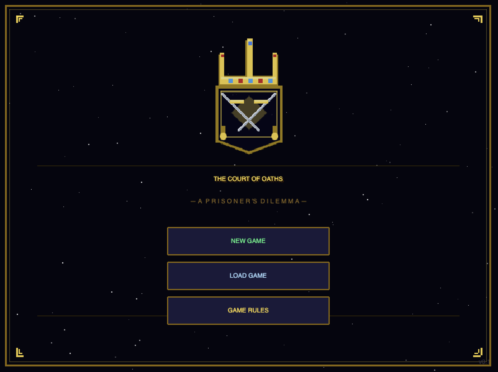

# The Court of Oaths



A strategic prisoner's dilemma game where you negotiate, strategize, and compete against cunning AI opponents to become the most powerful figure in the court.

## Getting Started

### Option 1: Quick Start (No Installation)
Simply open `index.html` directly in your web browser. That's it! No server needed.

### Option 2: Local Development Server (Python)
If you have Python 3 installed:

```bash
./dev.sh
```

Then open: **http://localhost:8000**

### Option 3: Docker (Recommended for Production)
If you have Docker installed:

```bash
./run.sh
```

Then open: **http://localhost:8080**

The Docker version automatically:
- Builds a containerized environment
- Serves the game via nginx
- Live-reloads when you edit files
- Can be deployed anywhere

**Docker Installation:**
- [Download Docker Desktop](https://www.docker.com/products/docker-desktop) (includes docker-compose)
- Or: `brew install docker` on macOS

**Manual Docker Commands:**
```bash
# Build the Docker image
docker build -t court-of-oaths .

# Run the container
docker run -p 8080:80 -v $(pwd):/usr/share/nginx/html court-of-oaths

# Or use docker-compose
docker-compose up --build
```

---

## How to Play

1. **Open the game**: Simply open `index.html` in your web browser (no installation needed)
2. **Start a new game**: Click **NEW GAME** on the title screen, then pick a mode — **Normal** or **Blind Court** (see below)
3. **Choose your class**: Select a character class with unique abilities
4. **Pick your opponents**: Choose how many AI houses to compete against (1-5)
5. **Compete in rounds**: Navigate the court, negotiate with opponents, and make Cooperate/Betray decisions
6. **Win the game**: Reach one of four victory conditions before your opponents do

---

## Game Modes

From the title screen click **NEW GAME** and the Mode Select page will appear with two cards: **Normal** and **Blind Court**. Pick one to continue to class selection.

### Normal
- Each rival's archetype label (e.g. *The Saint*, *The Serpent*) is shown in the Negotiation screen.
- You know who you're up against and can pick the right counter-strategy immediately.
- Recommended for first-time players learning the payoff matrix.

### Blind Court
- **Archetype labels are never revealed.** In the Negotiation screen you only see `( ??? )`.
- **Archetypes are randomized every new game.** House Aurum might be The Saint in one run and The Serpent in the next — you can't memorize the assignment across runs, you have to read the rival in front of you.
- You must **deduce each rival's strategy from their actual moves** — read patterns, test with a probe betrayal, remember who held a grudge.
- Harder. Designed for players who already know the archetypes and want a real strategic challenge: how much Gold can you collect when you're flying half-blind?
- The same 5 archetypes are still in the pool (see below) — the puzzle is figuring out which house is which, every game.

> Tip for Blind Court: early-game "scout" turns pay off. Cooperate once, betray once, and watch the rival's response — that's usually enough to narrow down the archetype.

---

## Your Character Classes

Each class has unique passive and active abilities:

### Knight ⚔️
- **Passive:** Gain +1 Honor every time you Cooperate
- **Active Ability (Shield Oath):** If an opponent betrays you this turn, you lose 0 Gold (cooldown: 3 turns)
- Best for: Honor-focused players who value loyalty

### Rogue 🗡️
- **Passive:** Gain +2 extra Gold every time you Betray
- **Active Ability (Pickpocket):** Steal 3 Gold from your opponent regardless of the outcome (cooldown: 3 turns)
- Best for: Aggressive players who profit from deception

### Merchant 💰
- **Passive:** All Gold gains and losses are multiplied by 1.5×
- **Active Ability (Double Down):** Gold multiplier becomes 3× this turn instead of 1.5× (cooldown: 3 turns)
- Best for: Economic-focused players who want massive wealth swings

### Spy 🕵️
- **Passive:** See your opponent's committed move for 1.5 seconds before you decide
- **Active Ability (Frame Job):** Your opponent's bot perceives you as cooperating this turn (cooldown: 3 turns)
- Best for: Information-focused players who thrive on knowledge (especially in Blind Court, where this peek is your main read on a rival's strategy)

---

## The Three Resources

Everything runs on three resources (starting at 30, max 120):

- **Gold** ⭐ — Wealth and economic power
- **Trust** 💙 — Diplomatic relationships
- **Honor** ✨ — Moral standing and integrity

---

## The Payoff Matrix

Each round, you and your opponent simultaneously choose **Cooperate (C)** or **Betray (D)**:

| You | Opponent | You Get | Opponent Gets |
|-----|----------|---------|---------------|
| C | C | +1 Gold, +2 Trust | +1 Gold, +2 Trust |
| C | D | -3 Gold | +5 Gold, -3 Honor |
| D | C | +5 Gold, -3 Honor | -3 Gold |
| D | D | -1 Gold, -2 Trust | -1 Gold, -2 Trust |

**Key insight:** Mutual cooperation builds trust but modest gains. Betrayal is risky but rewarding if the opponent cooperates.

---

## Opponent Archetypes

You'll face 5 different opponent strategies (cycling through them):

### The Saint (Always Cooperates)
- Always chooses Cooperate
- Easy to exploit, but betraying him damages Honor
- Best beaten by: Consistent cooperation or economic strategies

### The Serpent (Always Betrays)
- Always chooses Betray
- Aggressive opponent who destroys Trust quickly
- Best beaten by: Shield Oath or avoiding high-damage interactions

### The Mirror (Copies Your Last Move)
- Cooperates if you cooperated last turn, betrays if you betrayed
- Rewards consistency, punishes exploitation
- Best beaten by: Establishing mutual cooperation patterns

### The Grudge (Cooperates Until Betrayed)
- Friendly at first, but never forgives betrayal
- One mistake locks him into permanent Betrayal
- Best beaten by: Never betraying (if possible)

### The Flatterer (Cooperates for 3 Turns, Then Betrays)
- Appears trustworthy initially but turns hostile
- Plan around the betrayal at turn 4
- Best beaten by: Early extraction of value or avoiding him

---

## Court Events

Each turn, a random **Court Event** appears that modifies the payoff matrix for that round:

- **Harvest Festival** — Cooperate grants double Gold this turn
- **Night of Knives** — Betray costs 0 Honor this turn
- **Plague Year** — All opponents lose 3 Gold immediately
- **Royal Favor** — +5 Honor immediately
- **Market Crash** — All Gold gains halved this turn
- **Trust Fall** — Mutual cooperate grants +5 Trust instead of +2
- **Famine** — No Gold gained this turn regardless of outcome
- **Spy Network** — All classes get a peek at opponent's next move
- **Blood Oath** — Mutual betray costs double Trust
- **Merchant's Guild** — +3 Gold for everyone immediately

---

## Knowing Your Rivals

How much you learn about each rival depends on the game mode:

- **Normal** — The rival's archetype label (e.g. *The Saint*) is shown during Negotiation.
- **Blind Court** — The label is never shown. Only the rival's move history and how they respond to your actions will tell you who they are.

In both modes, each rival's move history (the `C`/`D` pattern) is visible — that's your deduction material.

---

## Active Abilities

Each class has one special ability available every 3 turns. Click the **ability button** in battle to use it. Benefits stack with normal outcomes.

---

## Negotiation Phase

Before each battle, you can:

1. **Promise C** — Verbally commit to Cooperating. Opponent may honor it.
2. **Bribe** — Spend 5 Gold to persuade opponent to cooperate
3. **Skip** — Go straight to battle with no negotiation attempt

Negotiation doesn't guarantee the opponent will cooperate, but improves your odds.

---

## Win Conditions

First player to achieve ANY of these wins:

### Economy (Gold ≥ 100)
Dominate through raw wealth. Best for: Merchants, Rogues with active betrayal

### Diplomacy (Trust ≥ 70 with 3+ opponents)
Build trust with most opponents. Best for: Consistent cooperators, Knights

### Domination (Eliminate 2+ opponents by reducing their Gold to 0)
Destroy rivals economically. Best for: Aggressive Rogues, Merchants with events

### Honor Run (Never betray + 15+ turns + Honor ≥ 60)
Maintain perfect integrity. Best for: Knights, patient Saints-focused players

---

## Example Playthrough

**Setup:** Playing as **Merchant**, 3 opponents

**Turn 1:**
- Court Event: "Market Crash" (Gold gains halved)
- Opponent 1 (House Aurum): Unknown (???)
  - Negotiate: Promise C
  - You choose: Cooperate
  - Result: Both get +0.5 Gold (halved by Market Crash), +2 Trust
  - Opponent likely cooperated (trust building)

**Turn 2:**
- Court Event: "Harvest Festival" (Cooperate = double Gold)
- Opponent 2 (House Vex): Unknown (???)
  - Negotiate: Skip
  - You choose: Betray
  - Opponent betrays (unknown strategy)
  - Result: You get +3 Gold, -3 Honor; they get +3 Gold, -3 Honor
  - Both at -3 Honor, but you're slightly ahead on Gold

**Turn 3:**
- Court Event: "Royal Favor" (+5 Honor to you)
- Opponent 1 (House Aurum): Hint revealed ("Tends to be agreeable")
  - Negotiation: Bribe -5G (invest in relationship)
  - You choose: Cooperate
  - They cooperate (archetype suggests they would)
  - Result: +0.75 Gold (Merchant passive), +2 Trust
  - Gold: 35, Trust: 37, Honor: 50 (from Royal Favor)

**Turn 4:**
- Court Event: "Spy Network" (You peek at opponent's move)
- Opponent 3 (House Crest): Unknown (???)
  - You see: They will Cooperate
  - Negotiate: Skip
  - You choose: Cooperate (safe choice, you knew the outcome!)
  - Result: +0.75 Gold, +2 Trust
  - Opponent 1 cumulative: 6 rounds of history, archetype fully revealed as "The Saint"

**Mid-game advantage:** You're building Gold via Merchant multipliers, have discovered The Saint is easy to exploit, and can plan around future events.

**Strategy:** Continue farming The Saint with mutual cooperation, carefully probe The Flatterer to trigger betrayal before turn 4, use active abilities when Market Crash or similar anti-Gold events occur.

---

## Tips for Success

1. **Watch the patterns:** Use your first 6 turns against each opponent to learn their strategy
2. **Time your active abilities:** Save them for high-value events or critical moments
3. **Balance resources:** Don't neglect any single resource—you need all three to win
4. **Plan for archetypes:** Once you know an opponent's strategy, adjust your choices accordingly
5. **Use Negotiation:** It's free leverage—always try Promise C or Bribe to improve your odds
6. **Court Events matter:** Some events completely flip the payoff matrix—adapt on the fly
7. **Honor run is hardest:** Requires 15+ turns of pure cooperation, so start early if attempting it
8. **Rogues dominate economically:** Their combination of passive +2 Gold on Betray + Pickpocket ability makes wealth accumulation fast

---

## Controls

- **Mouse:** Click buttons to navigate menus and make decisions
- **Timer:** You have 6 seconds to choose Cooperate or Betray (defaults to Cooperate)
- **Menu button:** Top-right corner to restart or return to home

---

## Save & Continue

Your progress is automatically saved. When you open the game again, you can "Continue" your last game.

---

## Development & Project Structure

### File Organization
```
the-court-of-oaths/
├── index.html              # Main entry point
├── js/
│   ├── gameState.js        # Game state management
│   ├── resources.js        # Payoff matrix & resources
│   ├── classes.js          # Player classes & abilities
│   ├── bots.js             # AI opponent strategies
│   ├── events.js           # Court events system
│   └── scenes/
│       ├── BootScene.js    # Asset preloading
│       ├── TitleScene.js   # Main menu
│       ├── SetupScene.js   # Class & opponent selection
│       ├── MapScene.js     # Court overview
│       ├── NegotiationScene.js  # Pre-battle diplomacy
│       ├── BattleScene.js  # Main decision & outcome
│       └── WinScene.js     # Victory screen
├── assets/                 # Images & animations
├── Dockerfile              # Docker configuration
├── docker-compose.yml      # Docker Compose setup
├── run.sh                  # Docker launch script
├── dev.sh                  # Local dev server script
├── CLAUDE.md               # Developer documentation
└── README.md               # This file
```

### Tech Stack
- **Engine:** Phaser 3 (CDN-loaded, no build step)
- **Language:** Vanilla JavaScript
- **Styling:** Embedded CSS
- **Fonts:** Google Fonts (Press Start 2P)
- **Storage:** Browser localStorage (auto-save)

### Key Features
- **Two Game Modes** — Normal (archetypes shown) and Blind Court (archetypes hidden, deduce from behavior)
- **Court Events** — 10 random events that modify payoff each turn
- **Active Abilities** — Class-specific cooldown abilities (3-turn cooldown)
- **Negotiation System** — Promise/Bribe before battle to influence outcomes
- **Auto-Save** — Game state persists in localStorage

### Running Locally

**Development (live reload):**
```bash
./dev.sh
# or manually:
python3 -m http.server 8000
```

**Production (Docker):**
```bash
./run.sh
# or manually:
docker-compose up --build
```

**For Developers:**
- See `CLAUDE.md` for architecture & implementation details
- No build step needed—edit files and refresh browser
- Changes auto-sync in Docker via volume mount

---

Enjoy the Court of Oaths. May your choices be wise, and may your rivals fall before you.
